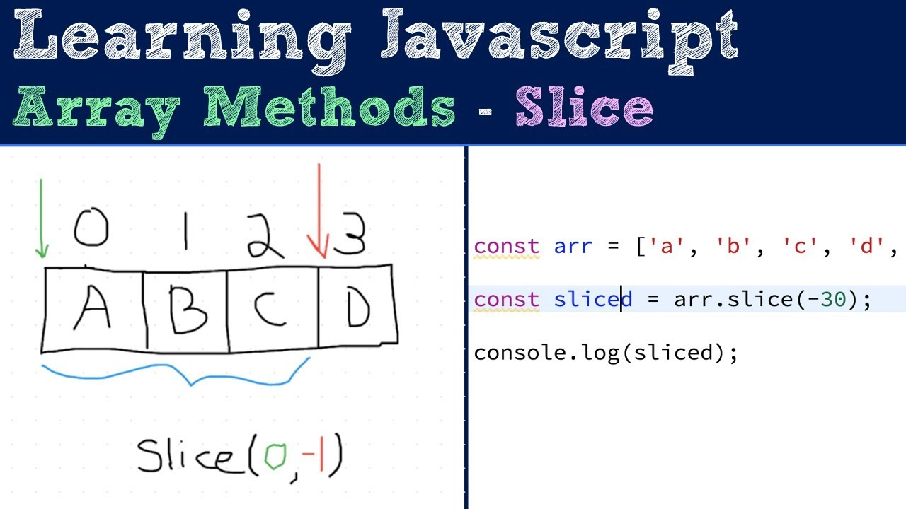
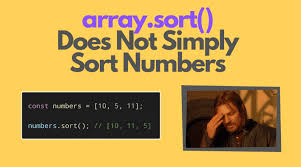
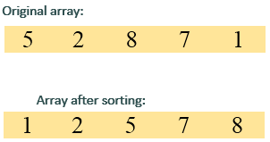

# Array
## What is Array in JavaScript?
### An array in JavaScript is a type of global object that is used to store data. Arrays consist of an ordered collection or list containing zero or more data types, and use numbered indices starting from 0 to access specific items.
.png)

# In JavaScript we have so many types of Methods
## 1.What is method shift() in JavaScript?
### The shift() method removes the first item of an array. The shift() method changes the original array.
.png)

## 2.What is method unShift() in JavaScript?
### Description. The unshift() method adds new elements to the beginning of an array. The unshift() method overwrites the original array.
.png)

## 3.What is method pop() in JavsScript?
### The pop() method removes the last element from an array and returns that value to the caller. If you call pop() on an empty array, it returns undefined . Array.prototype.shift() has similar behavior to pop() , but applied to the first element in an array. The pop() method is a mutating method.
.png)

## 4.What is method push() in JavaScript?
### .push() is a function in JavaScript that adds one or more elements to the end of an array and returns the new length of the array. Here's an example: javascript. let fruits = ["apple", "banana"]; // declare an array fruits. push("orange"); // add "orange" to end of array using push console.
.jpeg)

## 5.What is method concat() in JavaScript?
### The concat() method of Array instances is used to merge two or more arrays. This method does not change the existing arrays, but instead returns a new array
.jpeg)

## 6.What is method slice() in JavaScript?
### The slice() method of Array instances returns a shallow copy of a portion of an array into a new array object selected from start to end ( end not included) where start and end represent the index of items in that array. The original array will not be modified.

## 7.What is method splice() in JavaScript?
### The splice() method is used to add or remove elements of an existing array and the return value will be the removed items from the array. If nothing was removed from the array, then the return value will just be an empty array. Here is the basic syntax: splice(start, optional delete count, optional items to add)
.png)

## 8.What is method join() in JavaScript?
### The join() method concatenates all of the elements in an array (or an array-like object), separated by commas or a specified separator string, and returns a new string. If there is only one element in the array, the separator will not be used when returning the element. Syntax: array.join(separator)
.png)

## 9.What is method reverse() in JavaScript?
### Description. The reverse() method reverses the order of the elements in an array.
.png)

## 10.What is method toReversed() in JavaScript?
### As others mentioned, you can use . reverse() on the array object. Using . pop() method and while loop.
.png)

## And what is differents between methods reverse() and toReversed()?
### How toReversed() method is different from reverse() method in JavaScript. In JavaScript, reverse() and toReversed() methods do the same job as reversing but toReversed() does not change the original array. The reverse() method changes the original array.

## 11.What is method sort() in JavaScript?
### The sort() method of JavaScript compares the elements of the array by converting them into strings and then comparing their Unicode code points. This can lead to unexpected results when sorting arrays of numbers, as seen in the example where 10, 5, and 80 are sorted as 10, 5, 80 instead of 5, 10, 80.

### The best Example:
.jpeg)

# In JavaScript we have Callbacks methods.
## What is Callback in JavaScript?
### The callback function is called for each element of the array until it returns true for at least one element of the array. If neither of the elements in the array passes the test of the callback function, it returns false. Syntax: arr.some(callback(element[, index[, array]])[, thisArg])

## 1.What is method forEach() in JavaScript?
### Answered in 2.03 seconds. forEach() is a method in JavaScript that is used to loop over an array and execute a function on each element. The function can take up to three arguments - the current value of the element, the index of the element, and a reference to the array itself.
.png)

## 2.What is method map() in JavaScript?
### Description. map() creates a new array from calling a function for every array element. map() does not execute the function for empty elements.
.png)

## 3.What is method find() in JavaScript?
### The find() method of an array JavaScript object finds the first element in the array that satisfies a specified test and returns that element. If the test returns true, then the return value is null; otherwise, it is the value of its associated index position.
.jpeg)

## 4.What is method filter() in JavaScript?
### The filter() method is an iterative method. It calls a provided callbackFn function once for each element in an array, and constructs a new array of all the values for which callbackFn returns a truthy value. Array elements which do not pass the callbackFn test are not included in the new array.
.jpeg)

## 5.What is method sort() in JavaScript?
### The sort() method of JavaScript compares the elements of the array by converting them into strings and then comparing their Unicode code points. This can lead to unexpected results when sorting arrays of numbers, as seen in the example where 10, 5, and 80 are sorted as 10, 5, 80 instead of 5, 10, 80

## 6.What is method reduce() in JavaScript?
### The reduce() method is an iterative method. It runs a "reducer" callback function over all elements in the array, in ascending-index order, and accumulates them into a single value. Every time, the return value of callbackFn is passed into callbackFn again on next invocation as accumulator .
.jpeg)