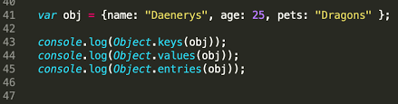
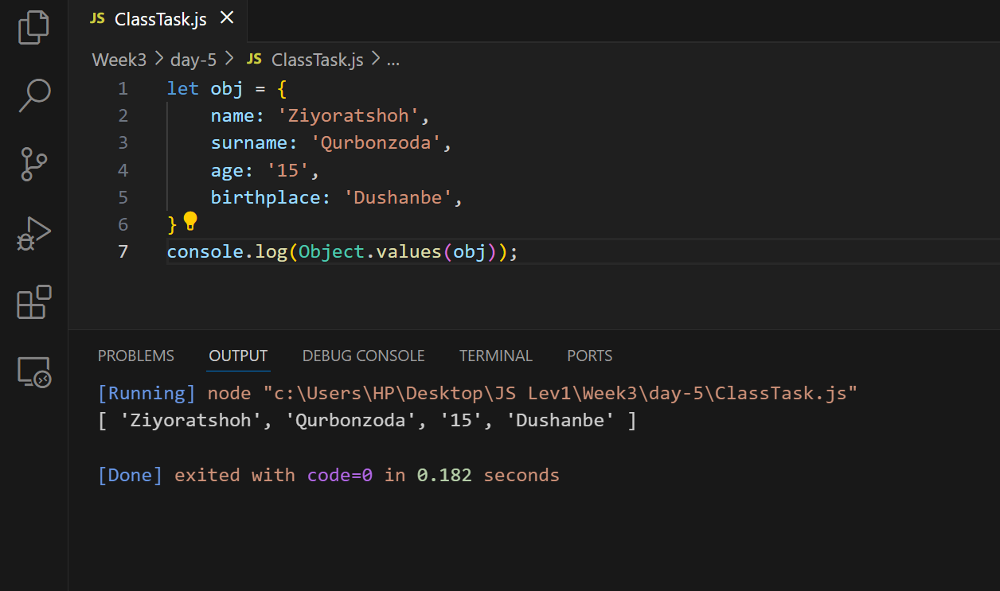
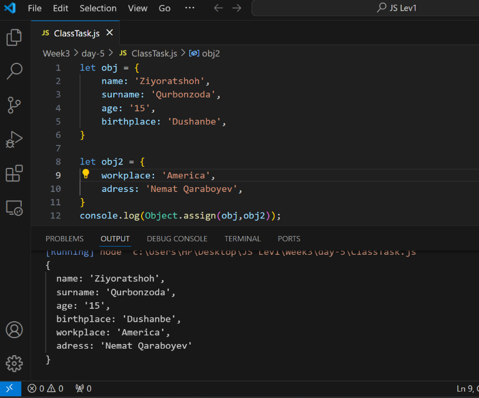

### 1.What does Mean Object in JavaScript?
## An object is a collection of properties, and a property is an association between a name (or key) and a value. A property's value can be a function, in which case the property is known as a method.

## The way how to create an Object in JavaScript?

# And also an Object has a property and inside the property we have 'Keys' and 'Values' in JavaScript.

## The important thing is Objects have four types of Methods!!!
### 1.Object.enteries()
### 2.Object.keys()
### 3.Object.values()
### 3.Object.assign()

## 1.What is method Object.enteries() in JavaScript?
### This methods returns our Object as an Array
#### For Example:

## 2.What is method Object.keys() in JavaScript?
### This methods return us the keys of our Object in array.
#### For Example:

## 3.What is method Object.values() in JavaScript?
### This methods return us the values of our Object in array.
#### For Example:

## 4.What is method Object.assign() in JavaScript?
### This methods will work as the string methods concat() it just paste two or more Objects in JavaScript.
#### For Example:

# 2.Destructing && Spread Object?
## What does mean Destructing in JavaScript?
### Destructing in array is a mekhanizm that can get any elements we want of our array with any name we want but Destructing in object also a mekhanizm that can get any property but we can't write any name we want we should write the name of our variable using the name of our object keys.

#### For Example:

# 2.What does mean Spread in Object?
## Spread like the same as in array is a mekhanizm that copies the properties of the Object
### For Example:
